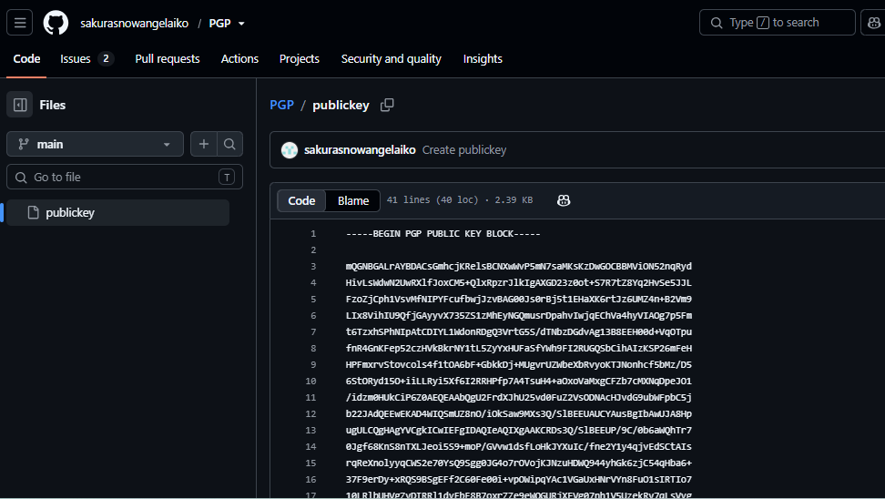
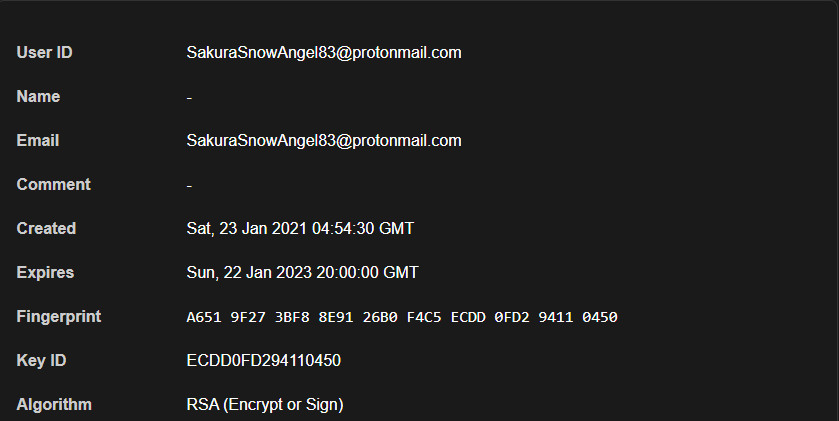
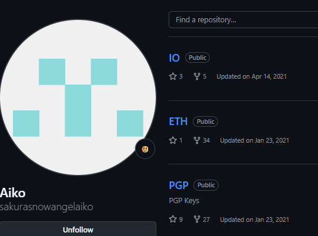
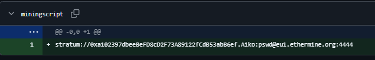
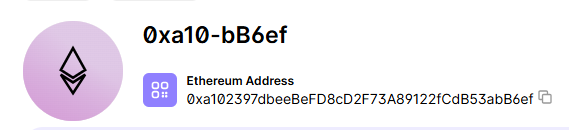
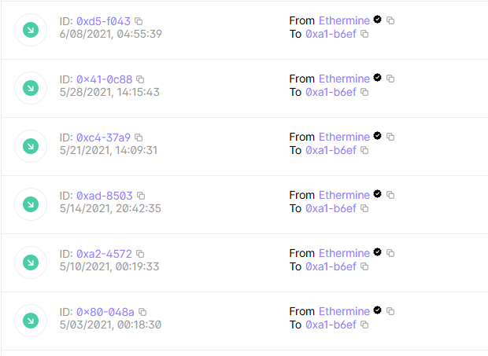
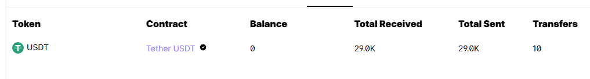
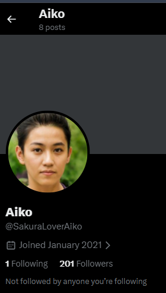
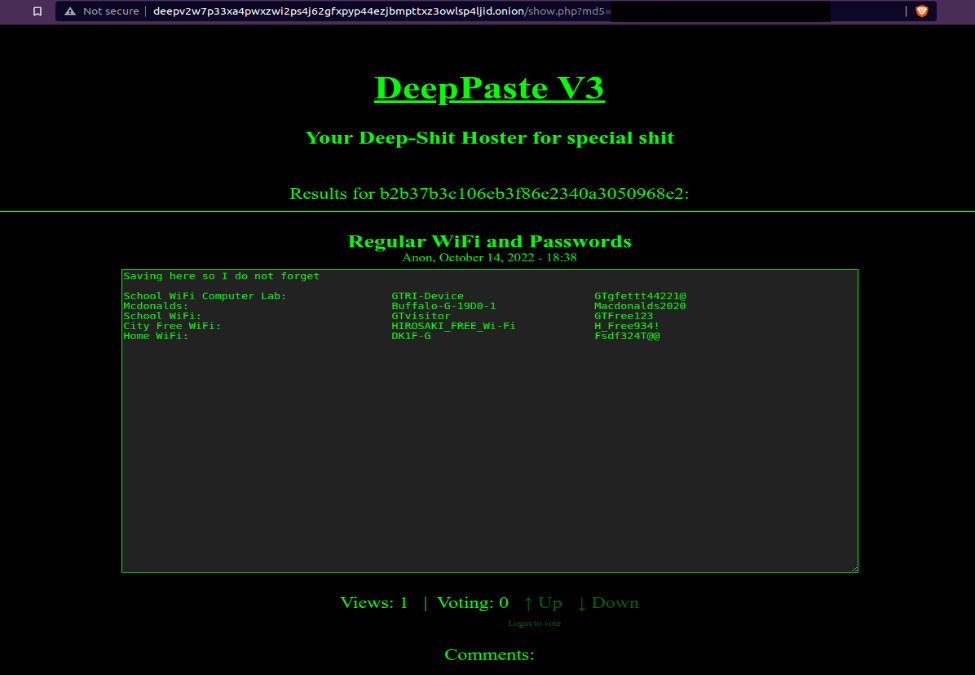

# Sakura -- OSINT

## TryHackMe

### Overview:

Sakura is a TryHackMe room made and published by OSINT Dojo. It is focused on Open Source Intelligence, specifically digital footprinting, identity resolution, and a slight bit of geographic OSINT. It simply follows the post incident analysis of an attack that occurred, where the attacker left a picture, and you are responsible for finding his identity just from the simple clues.

### Tools Used:

- Google
- Google Maps / Satellite Imagery
- SVG-React Convertor
- PGP Key Inspector

### Task 1: TIP-OFF

*For Task 1, you were required to find the attacker's digital username from a picture clue. The picture simply displayed a message from the attacker saying "You Got Pwned". Here's the solution alongside the detailed thought process.*

Right after opening the picture link, the first thing I took a look at was the URL, which indeed told us a lot. I found the name of the picture used, which was sakurapwnedletter.svg. I noticed that the file extension was SVG, which means **Scalable Vector Graphics**, and unlike a normal JPEG/PNG, an SVG is essentially an **XML/text-based file**. This means the image can contain information that isn't visible when you simply look at it.

So, my second thought was to immediately inspect the webpage containing the file and look at its metadata. After some further inspection, I found the file path linked to that published image, which, as you might have guessed, is our first flag: the attacker's username.

```
FLAG: SakuraSnowAngelAiko
```

### Task 2: RECONAISSANCE

#### Part 1:

*For the second task, we are actually required to find two flags. We are tasked with finding more information about the attacker, using the username we found in Task 1.*

Firstly, I decided to go with a very simple approach, which was Googling the username we found with a simple Google query **SakuraSnowAngelAiko -- TryHackMe**. The search results led me to three things: a GitHub page, an X page, and a Lead Contact page which had the name "Aiko Abe". This immediately raised my suspicions, so I decided to dig through the X page, where I found that the attacker could be Japanese after looking at his posts. Going back to the Lead Contact page, I was met with a brief description about Aiko Abe mentioning his Software Engineering role, which led us back to the GitHub page. The fact that the same name, profession, username, and online presence were consistent across these different sources gave me enough confidence that these accounts belonged to the same person. At this point, I was confident we had found our attacker and got our first flag.

```
FLAG: AIKO ABE
```

#### Part 2:

*For the second flag, we must find the attacker's email, using the username we have previously found.*

Since I had already gone through the attacker's X with no luck in finding his email, I decided to go through his GitHub, thinking I might find something useful. Landing on his GitHub, I was met with 9 repositories. Going through 8 of them with nothing interesting, I eventually landed on the PGP repo, which, after taking a closer look, seemed to contain a PGP Public Key. After understanding more about what PGP does and how it works, I decided to take this to a PGP Key Inspector, which immediately revealed the attacker's full email address.



```
FLAG: SakuraSnowAngel83@protonmail.com
```



### Task 4: UNVEIL

#### Part 1:

*For this task, we are needed to find 4 flags this time, we are tasked in investigating the users accounts after finding out that the attacker was alerted and started deleting information off his social media.*

I decided that since it involved technical crypto trading, it would most definitely be on GitHub, and that's where I went, looking at the attackers Repositories page, I Find a repo titled ETH, and surely enough that's the coin he was trading and also our first flag.



```
FLAG: ETHEREUM
```

#### Part 2:

*For the Second flag, we are tasked to find the attackers wallet address.*

Back to the GitHub repo I went, I opened the ETH repo as surely that's where it would be. The creator of the room actually gave us a really good hint here, mentioning that Aiko had already started deleting content from his social media pages. Surely that also applies to GitHub, so I opened the history tab, and there, the first version of his crypto miner was still there, which mentioned a link that I immediately went on and Googled.



And looking at the history of that wallet, we successfully find the attackers wallet address, and our second flag.



```
FLAG: 0xa102397dbeeBeFD8cD2F73A89122fCdB53abB6ef
```

#### Part 3:

*For the third flag needed, we are tasked in finding the mining block the attacker received payments on.*

This task was fairly simple as since we were already on the blockchain page I found that the attacker was actively receiving payments on Ethermine alongside another private wallet which isn't a mining block, therefore we have our flag.

```
FLAG: ETHERMINE
```



#### Part 4:

*In part 4 we are tasked to find another cryptocurrency the attacker was trading.*

This task was also fairly straightforward as the attacker was also trading tokens not just cryptocoins, so going on the Token history page, we find that he was trading Tether as well, which is also our flag

```
FLAG: TETHER
```



### TASK 5: Taunting

#### Part 1:

*For this part we have to find another two flags, we are tasked in investigating the attackers twitter/X account, and gather more private information to taunt the attacker.*

For the first flag, we need to find the attackers twitter handle, which we can easily get by going on his X account, that we got from previous tasks as mentioned and getting his Username.

```
FLAG: SakuraLoverAiko
```



#### Part 2:

*For the second flag we are required to get the attackers BSSID for his home WI-FI, this was a fairly complicated task as it involved going through an onion link for beginners.*

After thoroughly browsing through the attackers twitter account On a post, the attacker mentions: "Anyone who wants them will have to do a real DEEP search to find where I PASTEd them." The capitalized words "DEEP" and "PASTE" are a hint for **DeepPaste**, a dark web Pastebin.



Luckily a reddit user followed the onion links and did it for us,

Over here we can see the SSID of his network, So for that purpose, I will use https://wigle.net. Go to the advanced search page, paste the SSID, and you will receive the BSSID (here called Net ID).

```
FLAG: 84:AF:EC:34:FC:F8
```

### TASK 6: HOMEBOUND

#### Part 1:

*For task 6, we are required to find 4 flags, by investigating and finding the attackers route from his X posts.*

After checking the attackers twitter account, you can find he posted a view picture with cherry blossom trees, immediately I suspected this might be Japan, but lets not rush and paste that flag in, after a quick image reverse search, I found the image to be in Washington DC, therefore we found out that the start of the attackers trip was Washington, therefore the airport nearest to that picture taken, which is also our flag.

```
FLAG: DCA
```

#### Part 2:

*For the next flag we are required to find the airport the attacker had his LAST layover in,*

The attacker had an image post on his twitter, here is a JAL First Class Lounge Sakura Lounge located at the airport. And with a simple reverse image search, we have got the airport location.

```
FLAG: HANEDA
```

#### Part 3:

*For this flag we are required to find the attackers exact location through a geographic location picture posted from above,*

Assuming that is japan and Yep, an exact match. So... That lake is Lake Inawashiro, and also our flag.

```
FLAG: LAKE INAWASHIRO
```

#### PART 4:

*For this flag we are tasked to find the attackers home city.*

This was fairly simple as we already uncovered this from the WIFI list we found has an entry called "City Free WIFI", and that city is "HIROSAKI_Free_Wi-Fi" which is also our flag.

```
FLAG: HIROSAKI
```

### Finale:

That wraps it up for this room, Huge thank you to OSINT Dojo for this challenge, I had plenty of fun and learnt a lot of new researching techniques.
